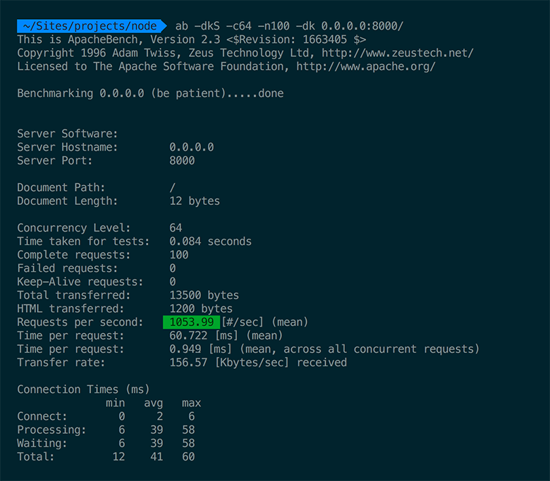

# Node.js multithreading

This repository demonstrates single-threaded nature of the Javascript. It is a HTTP webserver with several GET endpoints:

- `/` initial endpoint, printing `hello world` message
- `/delay` same as above, but response is delayed by 200ms with `setTimeout`
- `/db/:tld` this endpoint fetches 10 rows from Postgres DB, sql is `SELECT * FROM "user" WHERE email LIKE $1 LIMIT 10`
- `/fractal` generates nice ASCII fractal by quering Postgres (via [http://explainextended.com/](http://explainextended.com/2013/12/31/happy-new-year-5/)

All above endpoints are using I/O operations - Node won't block incomming requests even when operation is long-running (`/fractal`). You can test the performance of the Node server with [Apache bench](https://httpd.apache.org/docs/2.2/programs/ab.html) like this:

```
ab -dkS -c1 -n100 http://0.0.0.0/
```

Example output can look like this: (your'e interested in `Requests per second` number)



Try to experiment with concurrency switch. You can see that Node is pretty concurrent (can handle lots of requests per second) even when it is single-threaded. But there is one more endpoint:

- `/factorial/:num` compute factorial of the `num`

This is not I/O operation. Factorial is computed on the CPU. If you enter some big number (like `5555555555`) Node will not accept any parallel connections until factorial is computed (10s on my MBPr 2013). And is not possible to utilise free CPU core(s) to handle input traffic while factorial is processing. Or is it?

- `/factorial-thread/:num` compute factorial of the `num` by ofloading the computation to the [`Worker`](https://github.com/audreyt/node-webworker-threads#worker).

There is another possibility to get multithreading in the Node (since 0.12) - [cluster](https://nodejs.org/dist/v4.2.3/docs/api/cluster.html). To explore this variant please change to the `cluster` branch:

```
git checkout cluster
```

## Notes

- Project is written in ES6 using [Babel 6](https://babeljs.io/blog/2015/10/29/6.0.0/)
- Before running the server install all deps. `npm install`
- Run project by executing `node index.js`
- Database dump is provided, import it by running `psql YOUR_DATABASE_NAME < database.pgsql`

## License
MIT
